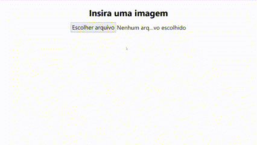

# color



## About the project
A code developed to use the library <a href="https://pypi.org/project/extcolors/">extcolors</a> for extract a color palette from an image and show the result in a page.
Also have an option to remove a color of the color palette from the image to show the importance of each color presence in the image. 
To remove color were developed two method: the Speed method and the Quality method. The Speed method using a tolerance to "remove" a color from an image, changing the pixel this color to white. The Quality method using an interable object with all colors include in each color from color palette get when extract the color palette.

## How to use
 - With installed <a href="https://www.python.org/downloads/release/python-3107/">Python 3.10.7</a> execute the follow commands in the project root:
```
pip install -r requirements.txt
pip install "Flask[async]"
python -m flask --app .\app.py --debug run
```
 - Open the http://127.0.0.1:5000/ in a browser;
 - And enjoy it!

